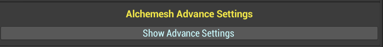

# Alchemesh - Mesh & Material Combiner

---

<aside>
💡 A mesh and material combiner to optimize any over-polygonized project and improve the end-user experience.

</aside>

# **Overview**

This tool focuses on a very specific part of video game development. A crucial part if you want your project to be as efficient as possible, and not lower the fps unnecessarily. Optimization for your project thanks to an extremely easy to use tool.

- We have created the ultimate tool for combining meshes and materials.

- With this tool you can forget about having to waste time manually combining the textures of your models, modifying the uvs and checking that all this is applied correctly, because you can do all this with a single click.

- With a simple and intuitive configuration, designed for developers (no programming knowledge required). Everything organized in a window interface to avoid having objects with unnecessary components in your scenes, and enjoy the tool globally (just one click from any of your scenes).

- An extensive configuration, but as simple as two buttons to combine meshes and materials, and an extra one to reset the default configuration (the most common for most cases).

- Enjoy this tool in any kind of project, with all the necessary documentation, and several test scenes, so you can get used to it, and see in which ways it could be useful for you.

Alchemesh has been created with the purpose of helping developers to complete their games, and make them as efficient as possible.
This tool will allow you to optimize your projects without losing quality, and port those projects to other platforms such as mobile or switch, where you would normally have to spend a lot of time modifying the models so that the game experience does not suffer because of low fps.
If you are still not clear about the operation of this tool I recommend you to take a look at the promotional videos in which everything you need to know is shown.

# **Getting Started**

Welcome to the Alchemesh documentation in which you will learn how to use this tool step by step, and in a simple way.
The first thing would be to install the package with the tool, but if you are reading this, you have probably already completed that step, so let's move on to the next one.
Once the package is installed, you will see the following folder structure.

In the Alchemesh folder you will have everything related to the tool and its code. 
In this folder you will find the specifications of the tool (do not modify), and this same documentation in PDF format.

Important parts to keep in mind at this point, would be that by default the tool will save all the textures that you combine in the SaveImages folder.
And inside the Tests folder, you will find a scene with several tests (seen in the promotional video) which you can review to better understand the operation of this tool.
In the rest of the folders you will only find the files necessary for Alchemesh to work correctly. Let's move on to the use of the tool as such.

# *Alchemesh - Window Editor*

Note that the whole interface is mostly intended to configure the combination of materials, since it is the part with the highest level of complexity. In case you only require mesh combination, simply take into account the Models container section since the tool uses the same system to search for models to combine in both cases. 
The tool is global, which means that it has its own window, accessible from any scene in the project, and by default the path to open this window is located in Tools/Alchemesh/Open Window (at the top left of the project).

When you open the window you will see something like this.

To make everything clear we will go through each element of the configuration in detail (this configuration is intended for the combination of materials, so for the mesh combination this part is not relevant).

# *Alchemesh - Basic Configuration*

Models container: this element requires a parent object which contains all the models to be combined (meshes, materials, or both). 
This is the system chosen for its simplicity and agility at the time of combination. 
The most important thing to keep in mind is that the objects contained within the container should not have inheritance, so simply place the models separately (all of them as children of the container).

Shader Reference: here you must reference the shader (necessary to reference the material properties), which is important that it is the same (or at least buy the same references) used by the materials to be combined, so that the references match when combining the materials.
A good recommendation would be to use a good shader that contains references for most of the textures that a material can have. For example, in case of using URP, a good option could be a Lit (Packages/UniversalRP/Shaders/Lit).

Texture Name: in this text input, type the name you want the textures resulting from the combination to have. By default CombinedTexture so that it matches the texture resulting from the mesh combination. And as a result, you would have something like this: CombinedTexture_MainTexture, CombinedTexture_MetalicTexture, etc.

Texture Format Decompression: this option, like the next one, is only recommended to modify it in case you have knowledge about the compression format of the images, and in that case you will have available all the formats that Unity allows. Do not worry about the normal ones, these are treated separately with their specific format.

Texture Read / Write Decompression: The above mentioned is repeated, but in case you want to modify it, you have available the options offered by Unity.

Texture Size: you will be able to choose between different resolutions, depending on the quality you want as a result. Keep in mind that the more textures you are going to combine, the higher the resolution should be to lose as little resolution as possible, and thus maintain the original quality of the image. You will find the most commonly used resolutions for this section (quadratic).

Folder Path For Textures: with a simple browse button you can select the folder in which you want to save the textures resulting from the combination. Just below you will have a preview of the current path in which the images are being saved, in case you need to remember it.

And finally you will be left with a configuration that looks something like this:

 
If you have come this far, congratulations, you already know the basic settings for using Alchemesh. Now we will see step by step the advanced configuration, thanks to which you will be able to determine which textures you want to combine, which material values you want to merge, and which colors you want to take into account (BaseColor and EmmissiveColor).

# *Alchemesh - Advanced Configuration*

Before starting, it is important to know the order of priority in the combination, since the textures will have priority, and from these you can also combine values and colors.
To view these settings, press the "Show Advance Settings" button.

You will be able to hide it again by clicking on the "Hide Advance Settings" button, which will be placed at the end of this configuration block.

Now it is quite possible that the window does not cover the entire configuration, so a scroll will appear to the right of the general block, which we can use to move around the interface. It is also possible to use the mouse wheel to scroll up and down.

In this advanced configuration, we have a window for each configurable part, ordered according to their fusion priority. First textures, then values, and finally colors (although values and colors do not have fusion problems, so these do not have priority between them, only textures do).

# Alchemesh Texture Settings
In this section you have the possibility to activate the textures that you want to combine, and specify the key of the property that contains that texture in your specific shader. In most cases they will be the ones that are defined by default, but in case they are not, it is as simple as looking for the shader that you are going to combine, and in the inspector itself you will see those keys.

In the case of Shader Graph simply edit the shader and you will see the name of the properties of the connected textures.
The textures supported in Alchemesh are the standard ones inside any material.

# Alchemesh Values Settings
In this section, the key activation and referencing process is repeated.

Repeat the process, and note that the metallic is disabled by default, because this value is not available in case of a metallic texture.

# Alchemesh Base Color Settings
In the case of color configuration, you will first find what we have seen above, with key reference and activation. On the other hand, there are two types of combination for this section, "Combine Mode" and "Preselected Mode".

In the initial case (Combine Mode), the combination process is as follows:
First, it will check if you activated textures for this property (Main Texture), and in case you did, what it will do is, in case of having texture, it will group that texture, and in case of not having texture, it will create a new one based on the color that has that material. 
If you did not activate the texture combination, it will give priority to the color, and will simply apply a white color to the final material, so, if you want to combine colors in your materials, I recommend you to activate the main texture, even if you do not have textures to combine.

And in case you activate the Preselected Color option, it will simply replace the color with the color of your choice in the resulting combined material.

# Alchemesh Emissive Color Settings
In this case, it will do the same as the previous section, with the only difference that the preselected color will be of the HDR type, which is the type of color that uses the emissive of the materials, to give that glow effect.

Congratulations, you know everything you need to start getting the most out of Alchemesh, now you can start optimizing your projects in a simple way. And remember that once configured, you just need to select the type of combination (button) you want, meshes or materials (or both). 
In case you want to combine both, I recommend you to combine first the meshes and then the textures / materials since it is better organized by execution.
And don't forget that if you need to restore the default values you can always use the "Reset Settings" button to do so.

# **Practical Examples**

Let us now review some case studies included in the Alchemesh test folder.
First we must open the scene with the prepared tests. Once we have the scene, we will see a couple of objects (one for the mesh combination tests and one for the material tests).

Now we are going to go first with the examples of mesh combination, so we will activate the first object.

This one comes with the first example already prepared. Some glasses, which we will combine to verify how simple and fast it is.
First, we will open the editor, in [Tools - Alchemesh - Open Window] and the only thing that we will have to configure in this case, will be the parent object that contains the models to combine. In this case Container_Test01.

And now we simply press the "Combine Meshes" button to see the result.

As we can see all the cups now share the same mesh, and their materials have been kept in the mesh renderer. Another important thing is that Alchemesh does not destroy objects, it keeps the original ones and simply deactivates them, creating a new object for the result of the combination. 
This way we do not have the risk of losing the option to have the original objects of the scene separated again.

For the next object let's deactivate this first one and activate Container_Test_02. 
As we can see for this example we have a much larger group of cups to combine, which will have a much larger optimization benefit for the project.
Let's first check what are the current values for fps and batches.

In my case, the fps hover around 400 fps (will vary depending on the graphics) and the batches stay at 2505. 
The next step will be to use the tool again to do some optimization magic.
We pass the container as a reference and press the combine button, just as we did before.
The combination in this case, given that the amount of polygonage is much higher, the combination is consistent, ie, the result will be groups of at most 65535 vertices (maximum number of vertices to combine in the same mesh) so in this case we will not have a single object. But taking into account that right now there are 180 cups, the result will be much more optimal without doubt.

The result is now around 700 fps (although it may vary depending on the graphics card) and only 141 batches, which is a brutal performance improvement.
This improvement is exponential, since the greater the amount of objects to combine the performance benefit will be much more remarkable.
As a result we obtain 8 groups of combined cups in this case. Which we can always group again to have a better organization.

Let's move on to the examples of material combinations, the crown jewel of this tool.
If we activate the first test of this second part, we will see again, three cups with different materials randomly placed in different parts of them.

For this example we will see that we can configure for this particular case, how simple and fast it is to combine materials, we will see that the tool can also combine colors, and even combine materials with more than one element.
The first thing to do is to pass the reference container. Now we will choose a suitable shader for the combination, and for this we will first see what kind of materials we are going to combine.
In this case the materials only have colors so we will deactivate the textures, and the only important values are the metallic and the smoothness.
Based on these needs we will look for a shader that fulfills these requirements, and personally I recommend to use a lit shader, since it is one of the most complete. And in my case as I am in URP I will use the Universal Render Pipeline lit shader.
To find it we will look in the path [Packages - Universal RP - Shaders - Lit] and we will assign it to the reference.
As name we will put CupTextures, the format of decompression of the image we will leave it by default since they have the best configuration at first. We will also leave the texture size since we only want to combine three materials in a new texture. And finally for the path, we will keep the default one.

Now let's look at the advanced settings, and in this case, as we have already mentioned, we will deactivate all the textures, for the values we will only keep the metallic and smoothness, and for the colors we will only activate the base color in "Combine Mode" since we want to obtain a new texture with the combined colors.

Finally we press the "Combine Textures" button and as simple as that, we have combined all the materials into a new one with our combined colors and values.

For the colors, as you can see you have created a texture and for the values you have averaged all the values related to that property. The result is a perfect match based on the best settings for this particular case.

Let's move on now to a slightly more complex example, including some textures.

In this case we are going to combine existing textures, so it is very important to take into account that the textures to be combined must have read/write enabled in the advanced options of that texture.

Once we make sure that all textures have this option checked, we can move on to the next part. Examine the materials and determine which configuration will be the best in this case.
In the case of the barrel, we have a main texture, we have no metallic texture, we have the smoothness set to 0 and we have a normal texture along with a value for it, and in the rest we see that we have no more textures and the emissive is disabled.

In the shark material, we see that we have again the main texture, so we know that we can deactivate the base color since the combination of materials prioritizes the textures and the color will be white by default. We see that we have metallic texture, so we will deactivate the value since it will prioritize the texture, we have value in the smoothness, and we have again normal texture and value, but the value is the one that comes by default in any material, so we will only activate the texture.

Now that we know our situation, let's move on to the configuration. For the basic options, we just change the reference container, and name it BarrelShark. And to test a better quality we can increase the resolution to 2048. 
Now for the advanced settings, we activate main texture, metallic and normal. For the values we only activate smoothness. And for the colors we deactivate both.

Now we simply combine by pressing the button and watch the magic happen.

As we can see we have created a new combined material, and if we look at the resulting textures maintain the resolution of 2048 in width, but go to 1024 in height, and this is because the texture packing seeks to maximize the space and not unnecessarily load a texture with empty pixels.

As you can see the final texture combines the textures of both elements and maintains the requested quality.

Finally we are going to perform a last test, with the last test. In this case we have a very simple level as an example to test a real case, in which we need to combine everything (meshes and materials).

In this case my recommendation is to combine the materials first and then the meshes, simply because it is more optimal for the execution.
The materials are the same as at the beginning so we will use the same configuration.  Let's try now with a lower resolution of 512, and let's name it LevelTest. We press the button to combine materials and we would already have a single material.

															
Now that we have the materials, it is as simple as pressing the combine mesh button, and we have it. The result is a whole level (very simple, but just to give you an idea) combined and ready for your game/project, but exponentially more optimized.

This is a very basic example of what a game level would look like, but imagine you have an entire city, with its buildings, trees, roads, etc. It would be as simple as deciding what groups you want to have, how you want to combine them, and with a quick configuration, and a couple of buttons, you would have the same city, only much more efficient.

That's all for now, enjoy the tool :)

- * For more information, take a look at the tutorial in the [asset store](https://assetstore.unity.com/publishers/55193) or on our YouTube channel ([BabelGames](https://www.youtube.com/channel/UCNsBWiGXJSE2ZTOKv5o-c2Q)) *.
